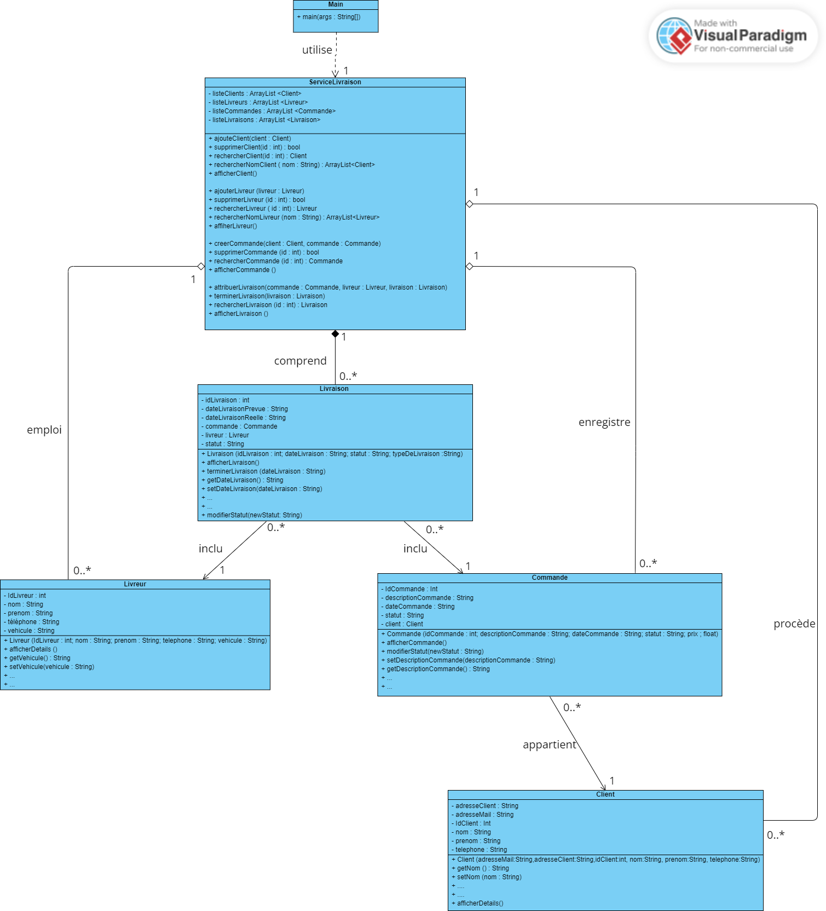

# 📦 Système de Gestion de Livraison (POO Java)

> Projet réalisé en binôme dans le cadre du module de Programmation Orientée Objet (Java).

Ce projet est une application console permettant de gérer un système logistique complet : clients, livreurs, commandes et livraisons, incluant des fonctionnalités de tri et un module de statistiques de performance.

---

## 🚀 Fonctionnalités principales

- **👥 Gestion des Clients** : Ajouter, afficher, rechercher (ID/Nom), modifier et supprimer.
- **🛵 Gestion des Livreurs** : Suivi des livreurs et de leurs véhicules associés.
- **📋 Suivi des Commandes** : Création de commandes liées à un client, mise à jour des statuts (en attente, en préparation, en livraison, livrée).
- **🚚 Logistique des Livraisons** : Affectation des commandes aux livreurs et suivi du statut.
- **📊 Module Statistiques & Filtres** :
  - Visualisation des performances (nombre de livraisons par livreur, identification du livreur le plus actif).
  - Tri des commandes par date et classement des clients.

---

## 🛠️ Architecture du Projet (Concepts POO appliqués)

Le projet respecte les grands principes de la programmation orientée objet :
- **Encapsulation** : Attributs privés et accès via Getters/Setters.
- **Associations complexes** : Relations entre les classes (une Commande possède un Client, une Livraison associe un Livreur et une Commande).
- **Structure de données** : Utilisation d'`ArrayList` pour une gestion dynamique des collections.

### Diagramme de Classes UML


---

```text
📁 systeme-livraison/
├── 📁 src/
│   ├── Main.java                         # Fichiers de code source Java
│   ├── Client.java
│   ├── Livreur.java
│   ├── Commande.java
│   ├── Livraison.java
│   └── ServiceLivraison.java
│
├── 📁 doc/                          # Documents et diagrammes
│   ├── Livrable Projet Poo Java.docx
│   └── Diagramme_UML.jpg
│
└── README.md
